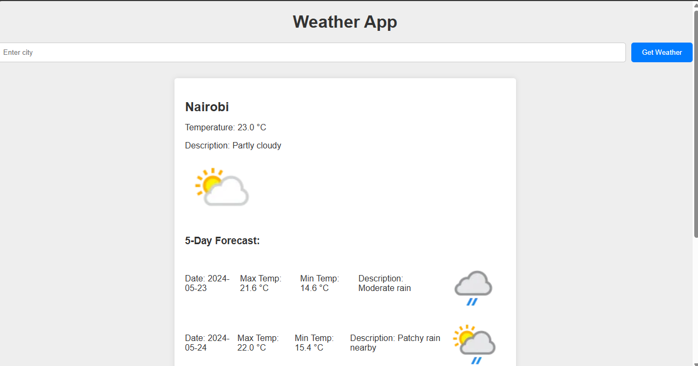

# Weather App

A simple weather application built with Python and Flask that fetches current weather data and a 5-day forecast using the WeatherAPI.



## Features

- Get current weather information for any city.
- View a 5-day weather forecast.

## Requirements

- Python 3.6+
- Flask
- Requests
- python-dotenv

## Setup

1. Clone the repository:

    ```sh
    git clone https://github.com/Isma3l-19/weather_app.git
    cd app
    ```

2. Create and activate a virtual environment:

    ```sh
    python -m venv venv
    source venv/bin/activate  # On Windows use `venv\Scripts\activate`
    ```

3. Install the required packages:

    ```sh
    pip install -r requirements.txt
    ```

4. Obtain an API key from [WeatherAPI](https://www.weatherapi.com/) and create a `.env` file in the root directory:

    ```sh
    echo "API_KEY=your_openweather_api_key" > .env
    ```

## Running the Application

1. Start the Flask app:

    ```sh
    flask run
    ```

2. Open your web browser and navigate to `http://127.0.0.1:5000`.

## Testing

Run the unit tests to ensure the application is working correctly:

```sh
python -m unittest discover -s tests
